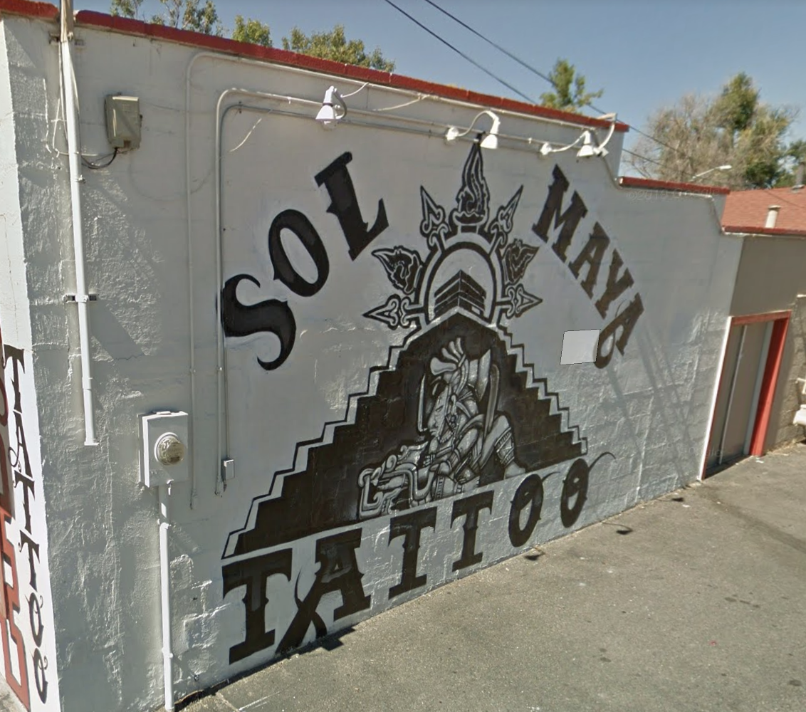
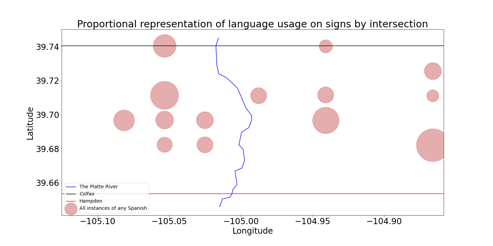
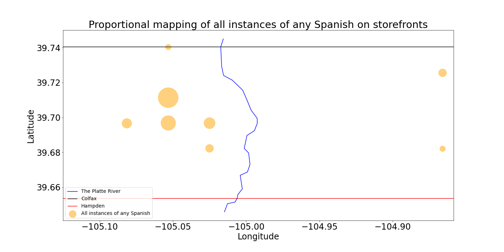
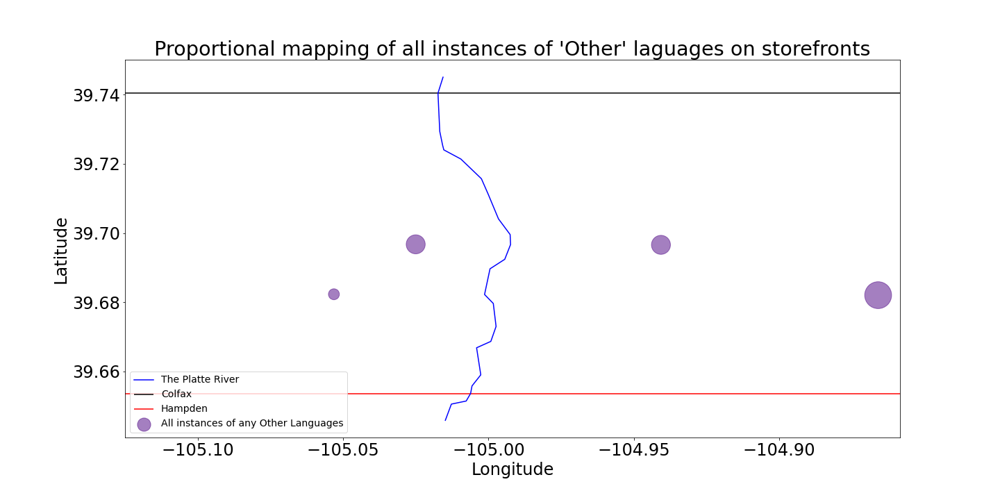

# soc_ling_final

Linguistic landscape on the East and West sides of the Platte River in South Denver: competing frequencies & functions of Spanish. Final project for Introduction to Social Linguistics course at The Unviersity of Colorado, Denver, taught by Gabriela DeRobles.

The code is still a mess.

## (1.0) Introduction
### (1.1) Linguistic landscapes

Spoken language has consistently proven a difficult entity to research because it--like a cultural value--is highly untangible; this intangible component of society is referred to as a mentifact. Methods have been developed to study spoken language, but all of these methods involve quantifying the concrete, physical component of spoken language, which is sound, but sound is transient and bound completely to the construct of time. There is, however, a more persistent manifestation of language--written word.

Writing, unlike spoken language, is an artifact of society. The sum of the writing in an environment is referred to as a linguistic landscape. Linguistic landscapes are often studied because--with the proper analysis--they are reflections of the diversity, culture, practices, perceptions, and values of a society. Although linguistic landscapes likely function differently from spoken language, there are many parallels to be drawn. This paper proceeds with the hopefully not too optimistic assumption that linguistic theories that have been applied exclusively to spoken language are at least somewhat applicable to the patterns and behaviors of linguistic landscapes.

### (1.2) Linguistic barriers: Geographical and social distance

Geographical distance is a large factor in the character of populations. A prime example of this is seen in the instance of gene flow (how gene frequencies change as a result of contact between populations), where, as geographical distance increases, gene frequencies are spread across populations, increasing biological diversification, and, eventually, leading to the development of a new species. Further, gene flow is not a mere one-directional shift, but can also occur with contact between populations. This same pattern can be seen with language, as well (Huisman, Majid, & van Hout, 2019). Geograpical distance plays a large role in the development of new dialects and langauges, as well as the outcomes of language contact phenomena such as pidginization, creolization, and dialect mixing & leveling.

Geographical distance can be seen as a function of a combination of the time and energy required to travel a specific distance. Traditionally, large geographical barriers (such as mountains or rivers) increase this geographical distance because they increase both the time & energy required to cover the allotted distance. And so, these geographical barriers eventually result in large differences in the populations on either side of the barrier. To continue the biological analogy, this phenomenon occurs with speciation in biological evolution; an example of this is how humans' last common ancestors, Bonobos and Chimpanzees, likely speciated due to the development of the Congo river. And, once again, geographical barriers also play a role in geographical distance relating to language. Pulgram (1969), for example, notes the paramount impact that mountain ranges played on the deviation of Vulgar Latin in ancient Italy, and, eventually, the profound linguistic diversification of modern Italian dialects. The mountain ranges were barriers that required much larger energy stores & time periods to cover short distances that would not be intangible on flat-ground. This limited contact between groups, thus increasing the geographical distance, and eventually the linguistic difference, between them.

Geographical distance is not the only contributing factor, though. The linguistic configuration of an area--as well as the probability of contact between language communities/groups--is a function of three major factors: time, space, and social setting (Huisman, Majid, & van Hout, 2019).

In terms of temporal factors, there is the obvious fact that, if two languages are in the same place at different times, there is likely to be no contact between them (unless, of course, there is a physical component of the language, such as writing). However, the amount of time allotted for contact between groups or separation of groups also plays into this. Space mostly denotes the geographical distance covered above, but also refers to population density--a function of volume of space and frequency of language use. Finally, there is social setting, which refers to the abstract relationship between concepts such as social and cultural values, perceptions, practices, and so on.

Although social factors are less tangible, they are highly interrelated with geographical distance. Social distance could be defined as the degree of difference between socio-psycho-cultural qualities, as well as the *perception of* that difference). Social distance functions very similarly to geographical distance (Trudgill, 2000), for it isolates (alienates) groups, and eventually leads to larger linguistic difference. Social distance will be touched on in this study, but it will not be the primary emphasis.

Although most of the theory and research relating to geographical distance and geographical barriers as functions of linguistic distance focuses on spoken language, many parallels can be drawn to linguistic landscapes. Although linguistic landscapes do not 'communicate' and 'interact' to the same degree as spoken language, the communities and populations that develop the linguistic landscapes do. And so this study will explore a relatively small geographical barrier in South Denver, as well as the role it may play in in the linguistic landscapes on either side of that barrier.

## (2.0) Materials and methods

### (2.1) The geographical space

The geographical space in Greater Denver Area that was elected for this study is a relatively rectangular map that exists between Colfax Avenue to the North, Havana to the East, Hampden/285 to the South, and Kipling to the West. Although these four major roads were carefully elected as the bounds of the experiment, the space of the study stretches slightly beyond each of the roads in order to contain linguistic storefront features on all sides of their respective intersections (see Figure 1).

*Figure 1: Approximate area of current study (red) with approx. tracing of South Platte River (blue) (https://www.google.com/maps)*

This elected space, which henceforth be referred to as ‘South Denver,’ is inhabited primarily by Denver county (Figure 2), but it also reaches into portions of Arapahoe County towards the East and Jefferson County towards the West. In terms of city divisions, the ‘South Denver’ space  is once again primarily dominated by the (southern half of) the City of Denver. However, the space technically stretches outside the bounds of Denver proper: on the East side of the South Platte the allotted space also stretches slightly into the City of Aurora; on the West side of the South Platte the allotted space also contains the City of Sheridan and portions of the City of Lakewood. Portions of the City of Englewood are split across the East and West sides of the South Platte, but the proportion is much higher on the East side.

*Figure 2: Approximate area of study (red) relative to cities and counties of Greater Denver Area (MetroDenver, 2020)*

The South Platte River through South Denver was elected as the centerpiece of this study. The South Platte--although not a large river--parallels two high-traffic highways (I-25 and Hgwy 85, culminating to a portion of 'Route 85'), as well as many parks and open spaces: this will henceforth be referred to as the 'Platte Barrier'. Within the bounds of elected space, there are only 10 roads that pass across the South Platte Barrier--which averages out to about one road every 0.64 miles.

Although the Platte Barrier is not a major geographical barrier when compared to, say, the Rocky Mountains, or the Mississippi river in Memphis Tenesse, there is a bottleneck friction associated with crossing it, for all of the traffic is funneled into only 10 roads; also, the barrier (especially further North) inhibits foot and bike traffic since many of the roads that cross it are bridges with high-speed vehicle traffic. However--more than anything else--the Platte Barrier represents a social barrier between the East and West sides. If demographic groups are distinguished on either side, people of any demographic are less likely to cross that barrier when they move.(I need to find >1 article on Linguistic Landscapes to site.)

### (2.2) Sampling & randomization

Within the aforementioned bounds, six busy East/West streets were elected: Colfax Ave, Sixth Ave, Alameda Ave, Mississippi Ave, Jewell Ave, and Hampden Ave/Hgwy 285. Then, within the same bounds, four busy North/South streets were elected on the East side of the Platte Barrier: Kipling St, Wadsworth Blvd, Sheridan Blvd, and Federal Blvd, as well as 4 on the West side: Broadway, University Blvd, Colorado Blvd, and Havana St.

After the streets were assigned, C++ was used to combine the streets into 48 intersections--24 on either end--which were stored in two arrays. Then, a function utilizing a pseudorandom number generator was used to randomly select intersections on either end of the Platte. Using this code, a simple random sample (with replacement) was executed to elect 14 total intersections: seven on the East side of the Platte Barrier, and seven on the West side. These were written to a text document which was then manually edited for replacements. Conditions for replacement and reslection were as follows: (1) the intersection does not exist; (2) the intersection was discovered to be a highway-crossing (i.e. a bridge crosses over one of the cross streets); (3) the intersection was discovered to have no storefronts (e.g. it was in a residental neighborhood); and (4) the intersection was already selected and either chosen or replaced for reasons (1), (2), or (3).

### (2.3) Data Collection

For each intersection in the sample, GPS coordinates were recorded at the centerpoint of the cross-streets. Then, data was collected for the signs of each storefront adjacent to the intersection; there was not a numerical standardization for how far the storefront stretched from the intersection, however none of the storefronts exceeded one block from the intersection. Signs were coded into two main categories: maintitle & subtitle. Maintitle refered to the large, primary sign of the business/store; this was often--but not always--the name of the business. Subtitle may have refered to any additional signage that communicated information about the business: hours of operation, product and service descriptions, and open/closed signs would account for most of--but would not limit--the breadth of the subtitle sign component. Each storefront was 'visited' using Google Maps, a screenshot was taken, and data was recorded into a CSV file.

All private businesses were counted, including but not limited to gas stations, restaurants, autobody repair shops, hospitals, banks, car dealerships, and grocery stores. Absolutely no government, traffic, & property regulation signage was included in the dataset (e.g. "No Loitering," "Tejon St.," "No se fuma," etc.). No billboards were included in the dataset. (See limitations.)

### (2.4) Language coding parameters

Because the focus of the present study is Spanish, Spanish language usage was broken into four categories then assigned to each component of the sign (maintitle and subtitle):

**(1) Spanish (span):** if the language in the respective sign component was strictly Spanish--with no other languages present--the sign component was coded as 'Spanish,' or span.

**(2) Spanglish (spangl):** Spanglish was determined as a combination of Spanish and English lexicon, grammar, and nomenclature within a single phrase. For example, if a sign read "Santiago's Burritos," the sign was codes as Spanglish because: "Santiago" is a traditionally Spanish name, "Burrito" is a Spanish word that is borrowed in English, and the "'s" is a possesive morpheme in English but not in Spanish. (See Figure 3: "Taxes Unidos Services," and Figure 4: "Sol Tattoo" for more examples.)

*Figure 3: "Taxes Unidos Services" Spanglish maintitle example (Google)*

*Figure 4: "Sol Tattoo" Spanglish maintitle example (Google)*

**(3) Translation (transl):** Translation was determined to be a combination of Spanish and English where and expression in either one of the languages was translated into an equivelant (or close match) in the other language. An example of this is seen below, where "Coin Laundry" is translated after a slash as "Lavanderia," and "Free dry with wash" is translated below as "Secado gratis con lavado" (Figure 5).

*Figure 5: "Coin Laundry/Lavanderia" Translation maintitle and subtitle example (Google)*

**(4) Mix (mix):** If the sign component contained both Spanish and English, but the phrases were distinct/separate and the uses of each language denoted different signifcances, then the sign component was coded as "Mix" (mix). As can be seen below in the subtitle in Figure 6, "Hours:" is translated into "Horarios," yet the days (e.g. "Mon - Turs") are as well as "Orders to go" are only depicted in English, while still again "Restaurante" and "Jaliciense" (of or relating to Mexican state of Jalisco) are only depicted in Spanish.

*Figure 6: "Poncho's Mexican Resaurant" Mix subtitle example (Google)*

All use of English--excluding English presence in Spanglish, Mix, & Translate contexts (see above)--was coded as "English" (engl). All other language usage was coded as "Other" (other). The word "Colorado" was excluded from the parameters of sign coding because it is traditionally a Spanish adjective, yet it is also the name of the state, and thus it would be confounding.

### (2.5) Data analysis and representation

All of the data calculation, analysis, and representation was completed in a Python notebook in Jupyter Lab utilizing libraries: matplotlib, numpy, pandas, scipy.stats, and statistics (see analysis&representation.ipynb). (The code is honestly a mess right now. The data collection took far longer than was expected, and the code was written in a hurry to assure completion of the final project by the deadline.)

## (3.0) Results

### (3.1) Sample

Seven intersections (n = 14) on each end of the Platte Barrier were examined and analyzed. Across those 14 intersections a sample of storefronts (n = 121) were collected; there was an average of 8.64 storefronts per intersection across the entire sample.

On the East end of the Platte Barrier there was an average of 9.71 storefronts per intersection (n = 68); on the West end of the Platte Barrier there was an average of 7.57 storefronts per intersection (n = 53). Figure 7 displays a proportional distribution of the language-usage on either side of the Platte Barrier. 

*Figure 7: each bubble represents one intersection, and the size of the bubble represents the proportional usage.*

On the East side of the Platte Barrier, there were a total of 59 pure-English maintitles and 29 pure-English subtitles; these counts made up 86.76% and 93.55% of the total language use on the East side, respectively.  On the West side of the Platte Barrier, there were a total of 33 pure-English maintitles and 31 pure-English subtitles; these counts only made up 62.26% and 77.5% of the total language use on the West side, respectively. 

All uses of Spanish, including Spanish, Spanglish, Mix, and Translation (see section [2.4]) accounted for a large percentage of the non-English language usage on the West side. On the East side of the Platte Barrier maintitles were represented by 2.9% Spanish use, and subtitles were represented represented by 0.0% Spanish use. On the West side, however, maintitles were represented by 26.42% Spanish use, and subtitles were represented by 22.5% Spanish use. Figure 8 represents this relative Spanish distribution:

*Figure 8: each bubble represents one intersection where some form of Spanish was used, and the size of the bubble represents the proportional usage*

'Other' language usage, on the other hand, accounted for the ajority of non-English usage on the East side. On the East side of the Platte Barrier Other language maintitles accounted for 10.29% of maintitle language use, and Other language subtitles accounted for 6.4% of the subtitle language use. On the West side, Other language maintitles accounted for 7.5% of the maintitles and 0.0% of the subtitles. Figure 9 represents this relative Other-language distribution:

*Figure 9: each bubble represents one intersection where some form of Other language was used, and the size of the bubble represents the proportional usage*

### (3.2) Spanish usage

On the West end of the Platte, 6 out of the 7 intersections (85.71%) had at some instance of Spanish language usage. However, on the East end of the Platte Barrier, only 2 out of the 7 intersections (28.57%) had some instance of Spanish. The sample would indicate that it is ~3  times more likely that an intersection will have Spanish on the West end of the Platte Barier.

The end results displayed that there were an average of 3.25 Spanish uses per intersection (SD = 3.25) ont he West end of the Platte Barrier, and only an average of 0.29 Spanish uses per intersection (SD = 0.49) per intersection on the West side. A 2-sample t-test (p < 0.05; assuming unequal variance) revealed that there is *not* enough evidence to support that the *average* number of Spanish spearking instances *per intersection* is different on either end of the Platte Barrier. However, this result is highly inconclusive due to the extremely small sample size (n = 7).

However, when comparing the proportion of Spanish-language usage to all other language use (English use + Other language use), a 2-sample t-test (p < 0.005; assuming unequal variance) provides dignificant evidence that the proportion of Spanish-language use is higher on the West end of the Platte Barrier. 

## (4.0) Discussion

### (4.1) Spanish language usage

Although this research revealed that there is a significant difference of Spanish-language usage on either end of the Platte Barrier, it cannot be necessarily concluded that this difference is *a result of* the Platte Barrier. However, if one observes Figure 8, it can be seen that the first two Spanish instances Westward of the Platte Barrier are on the most Eastward North-South street, Federal Blvd. Then, the Spanish-language usage by-intersection either increases or at least retains as the sample moves further West. However, as the sample moves East of the Platte Barrier, there is not any Spanish-language usage until the 4th and final North-South street included in the sample--Havana St. This large lack of Spanish just East of the Platte Barrier could indicate that, as the Spanish-speaking community moves, develops, and grows, it moves West--away from the Platte Barrier. However, it is also possible that the small intersection sample on each side (n = 7) was not enough to be representative. 

### (4.1) Limitations

The primary limitation for this study was, unfortunately, time. Had more time been alloted for data collection, a more representative sample could have been drawn, which would have allowed more conclusive results. Further, had more time been alloted for data analysis, more could have been drawn from the data, such as geographical distributions and distances relative to the Platte Barrier.

This study would have benefitted immensely if it had been synthesized with previous research on linguistic landscapes, demographic distributions, language use in communities, and Spanish-language usage. However, little research has been done regarding geographical distributions of multi-lingual linguistic landscapes. Further research should address some of these limitations.

### (4.2) Future research

As gentrification in the greater-Denver area continues to displace Spanish-speaking communities, especially in the neighborhoods just North-West of downtown Denver (and just north of the West end of this sample), what are today referred to as 'the Highlands,' it will be interesting to see if this Westward expansion develops away from the Platte Barrier. Future research should utilize a larger sample size, and should also account for the same trends in Denver North of Colfax Ave. 

Future research could also benefit from more interpretation of the geographical data collected. Language usage could be mapped, analyzed, and compared according to relative distance and distribution from the Barrier. Further, comparrison with demographic data would augment this research and help to draw conclusions about the usage of Spanish, and the types of Spanish usage (see section [2.4]), relative to the distribution of Hispanic communities. It would be extremely insightful to learn about how contact between ethnic and/or linguistically diverse communities contributes to the types of Spanish seen on storefront signs, and if the points of contact lead to larger proportions of Spanglish, Mix, and Translation signage. It is vital, however, that larger samples are collected to  draw these types of conclusions.

## (5.0) References

Ernst, P. (1969). *The tongues of Italy: prehistory and history.* Greenwood Press.

Huisman, J. L. A., Majid, A., & van Hout, R. (2019). The geographical configuration of a language
area influences linguistic diversity. *Public Libary of Science.* 14(6).

Trudgill, P. (2000). “Chapter 5: Language and Context,” *Sociolinguistics: An introduction
to language and society.* (4th ed., pp. 81-104). Penguin Books.

Metro Denver (2020). Communities. *MetroDenver Economic Development Coorporation.* *http://www.metrodenver.org/do-business/communities/

Google (2020). Google Maps. *Google.* https://www.google.com/maps
