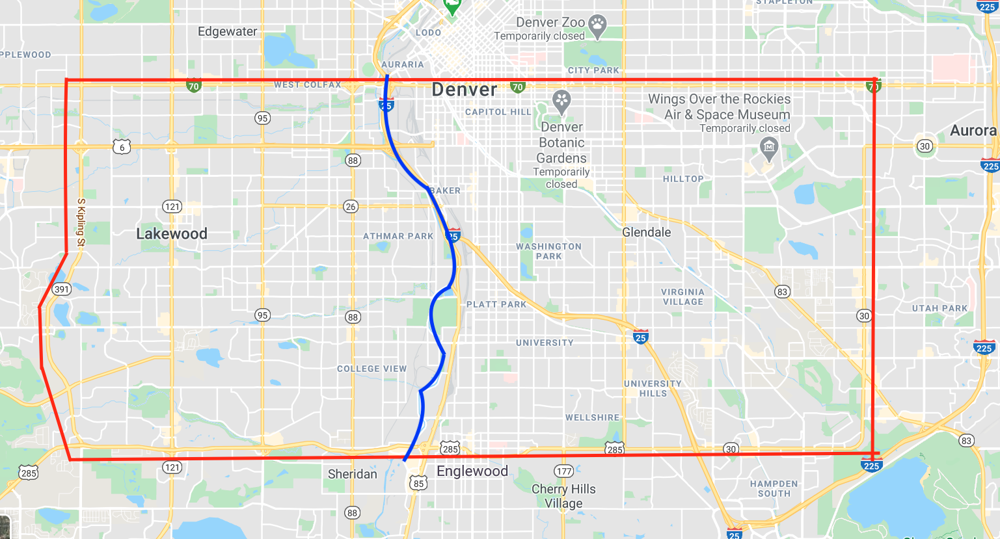
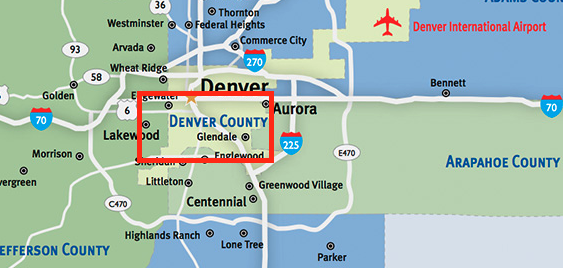
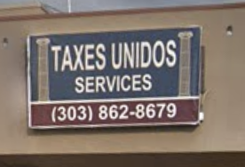
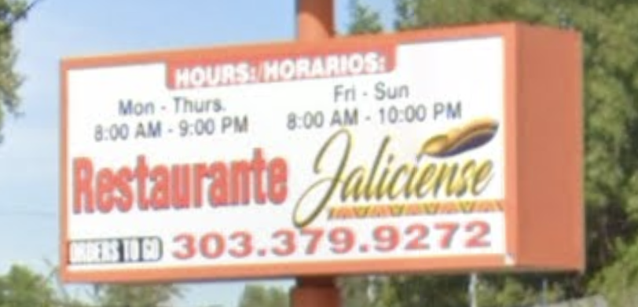

# soc_ling_final
Final Project on Linguistic Landscapes for my Social Linguistics course @ CU Denver

## (1.0) Introduction
### (1.1) Linguistic landscapes
### (1.2) Linguistic barriers: Geographical and social
### (1.3) Competing funtions of language usage in Denver

## (2.0) Materials and methods
### (2.1) The geographical space

The geographical space in Greater Denver Area that was elected for this study is a relatively rectangular map that exists between Colfax Avenue to the North, Havana to the East, Hampden/285 to the South, and Kipling to the West. Although these four major roads were carefully elected as the bounds of the experiment, the space of the study stretches slightly beyond each of the roads in order to contain linguistic storefront features on all sides of their respective intersections (see Figure 1).

*Figure 1: Approximate area of current study (red) with approx. tracing of South Platte River (blue) (https://www.google.com/maps)*

This elected space, which henceforth be referred to as ‘South Denver,’ is inhabited primarily by Denver county (Figure 2), but it also reaches into portions of Arapahoe County towards the East and Jefferson County towards the West. In terms of city divisions, the ‘South Denver’ space  is once again primarily dominated by the (southern half of) the City of Denver. However, the space technically stretches outside the bounds of Denver proper: on the East side of the South Platte the allotted space also stretches slightly into the City of Aurora; on the West side of the South Platte the allotted space also contains the City of Sheridan and portions of the City of Lakewood. Portions of the City of Englewood are split across the East and West sides of the South Platte, but the proportion is much higher on the East side. 

*Figure 2: Approximate area of study (red) relative to cities and counties of Greater Denver Area (http://www.metrodenver.org/do-business/communities/)*

The South Platte River through South Denver was elected as the centerpiece of this study. The South Platte--although not a large river--parallels two high-traffic highways (I-25 and Hgwy 85, culminating to a portion of 'Route 85'), as well as many parks and open spaces: this will henceforth be referred to as the 'Platte Barrier'. Within the bounds of elected space, there are only 10 roads that pass across the South Platte Barrier--which averages out to about one road every 0.64 miles.

Although the Platte Barrier is not a major geographical barrier when compared to, say, the Rocky Mountains, or the Mississippi river in Memphis Tenesse, there is a bottleneck friction associated with crossing it, for all of the traffic is funneled into only 10 roads; also, the barrier (especially further North) inhibits foot and bike traffic since many of the roads that cross it are bridges with high-speed vehicle traffic. However--more than anything else--the Platte Barrier represents a social barrier between the East and West sides. If demographic groups are distinguished on either side, people of any demographic are less likely to cross that barrier when they move.(I need to find >1 article on Linguistic Landscapes to site.)

### (2.3) Sampling & randomization

Within the aforementioned bounds, six busy East/West streets were elected: Colfax Ave, Sixth Ave, Alameda Ave, Mississippi Ave, Jewell Ave, and Hampden Ave/Hgwy 285. Then, within the same bounds, four busy North/South streets were elected on the East side of the Platte Barrier: Kipling St, Wadsworth Blvd, Sheridan Blvd, and Federal Blvd, as well as 4 on the West side: Broadway, University Blvd, Colorado Blvd, and Havana St.

After the streets were assigned, C++ was used to combine the streets into 48 intersections--24 on either end--which were stored in two arrays. Then, a function utilizing a pseudorandom number generator was used to randomly select intersections on either end of the Platte. Using this code, a simple random sample (with replacement) was executed to elect 14 total intersections: seven on the East side of the Platte Barrier, and seven on the West side. These were written to a text document which was then manually edited for replacements. Conditions for replacement and reslection were as follows: (1) the intersection does not exist; (2) the intersection was discovered to be a highway-crossing (i.e. a bridge crosses over one of the cross streets); (3) the intersection was already selected and either chosen or replaced for reasons (1) and (2). 

### (2.4) Data Collection

For each intersection in the sample, GPS coordinates were recorded at the centerpoint of the cross-streets. Then, data was collected for the signs of each storefront adjacent to the intersection; there was not a numerical standardization for how far the storefront stretched from the intersection, however none of the storefronts exceeded one block from the intersection. Signs were coded into two main categories: maintitle & subtitle. Maintitle refered to the large, primary sign of the business/store; this was often--but not always--the name of the business. Subtitle may have refered to any additional signage that communicated information about the business: hours of operation, product and service descriptions, and open/closed signs would account for most of--but would not limit--the breadth of the subtitle sign component. Each storefront was 'visited' using Google Maps, a screenshot was taken, and data was recorded into a CSV file. 

### (2.5) Language coding parameters

Because the focus of the present study is Spanish, Spanish language usage was broken into four categories then assigned to each component of the sign (maintitle and subtitle):

**(1) Spanish (span):** if the language in the respective sign component was strictly Spanish--with no other languages present--the sign component was coded as 'Spanish,' or span.

**(2) Spanglish (spangl):** Spanglish was determined as a combination of Spanish and English lexicon, grammar, and nomenclature within a single phrase. For example, if a sign read "Santiago's Burritos," the sign was codes as Spanglish because: "Santiago" is a traditionally Spanish name, "Burrito" is a Spanish word that is borrowed in English, and the "'s" is a possesive morpheme in English but not in Spanish. (See Figure 3: "Taxes Unidos Services," and Figure 4: "Sol Tattoo" for more examples.)

*Figure 3: "Taxes Unidos Services" Spanglish maintitle example (https://www.google.com/maps)*

*Figure 4: "Sol Tattoo" Spanglish maintitle example (https://www.google.com/maps)*

**(3) Translation (transl):** Translation was determined to be a combination of Spanish and English where and expression in either one of the languages was translated into an equivelant (or close match) in the other language. An example of this is seen below, where "Coin Laundry" is translated after a slash as "Lavanderia," and "Free dry with wash" is translated below as "Secado gratis con lavado" (Figure 5).

*Figure 5: "Coin Laundry/Lavanderia" Translation maintitle and subtitle example (https://www.google.com/maps)*

**(4) Mix (mix):** If the sign component contained both Spanish and English, but the phrases were distinct/separate and the uses of each language denoted different signifcances, then the sign component was coded as "Mix" (mix). As can be seen below in the subtitle in Figure 6, "Hours:" is translated into "Horarios," yet the days (e.g. "Mon - Turs") are as well as "Orders to go" are only depicted in English, while still again "Restaurante" and "Jaliciense" (of or relating to Mexican state of Jalisco) are only depicted in Spanish.

*Figure 6: "Poncho's Mexican Resaurant" Mix subtitle example (https://www.google.com/maps)*

### (2.6) Data analysis and representation

All of the data calculation, analysis, and representation was completed in a Python notebook in Jupyter Lab utilizing libraries: matplotlib, numpy, pandas, scipy.stats, and statistics (see analysis&representation.ipynb). (The code is honestly a mess right now. The data collection took far longer than was expected, and the code was written in a hurry to assure completion of the final project by the deadline.)

## (3.0) Results

## (4.0) Discussion

### (4.x) Limitations

## (5.0) Conclusion

## References

http://www.metrodenver.org/do-business/communities/

https://www.google.com/maps